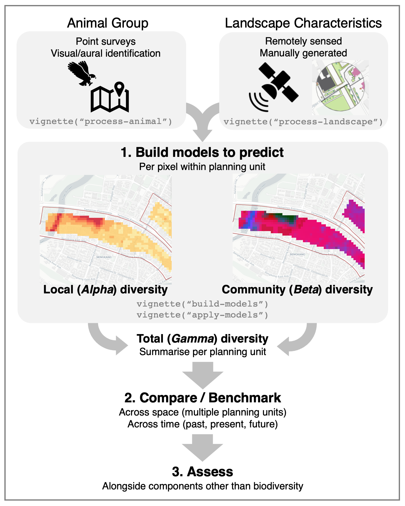

<!-- README.md is generated from README.Rmd. Please edit that file -->

# Spatial predictions of biodiversity across urban landscapes

<!-- badges: start -->

<!-- badges: end -->

 

## Overview

Many frameworks to assess ‘biodiversity’ have been proposed in research
and practice. Some offer a more holistic view, by including parts of the
ecosystem (e.g., climate, soil, air, water, landscape structure, genetic
variation) that may contribute to ‘total biodiversity’ within a given
region. However, such conceptualisations of ‘biodiversity’ may include
components with low causal proximity (e.g. indirect effect of the
landscape on species diversity), and may be difficult to measure at wide
spatial scales (e.g. genetic diversity, plant species diversity). In
decision-making, unnecessary complexity may also risk contributing to
mistrust or ignorance of the overall assessment.

`biodivercity` is an R package for assessing the diversity of animal
species in urban areas. It provides a way to directly assess the
*habitat value* of urban landscapes, based on their empirical effect on
chosen animal groups (e.g., taxa such as birds, butterflies, odonates,
amphibians, etc.). The key features include:

-   Step-by-step protocols for random point sampling of an animal group
    within areas of interest
-   Generate data summaries of the animals surveyed, at multiple levels
    of granularity (e.g., areas, periods, animal groups, species)
-   Download and process landscape data within areas of interest (e.g.,
    satellite imagery, OpenStreetMap data)
-   Convert vector data generated from future design scenarios into
    formats suitable for model predictions
-   Build and validate predictive models to assess *Alpha* (local),
    *Beta* (community) and *Gamma* (total) diversity for an animal group
-   Use models to make pixel-based spatial predictions across new areas
    and into the future
-   Summarise predictions to benchmark and compare biodiversity
    ‘performance’ between planning units across the city

 

<b> Figure: Broad overview of the data workflow for a chosen animal
group </b>

 

## Citation

To cite `biodivercity` or acknowledge its use, please cite the
following:

*Tan, E. Y. W., Song, X. P., Sim, H. J., Nai, J., Chong, K. Y. (2022).
biodivercity: An R package to assess the diversity of animal species in
urban areas. R package version 0.0.1 (unreleased).
<https://github.com/ecological-cities/biodivercity>.*

To get a BibTex entry, run `citation("biodivercity")`.

 

## Data sources

Development of a Biodiversity Index for Residential Towns using
Biodiversity Field Surveys. 14 June 2016, 6.5 years, Ministry of
National Development Research Fund (MNDRF) Grant. Awarded to the
National University of Singapore (host institution) and the Singapore
Housing & Development Board.

 

## References

Baker, D. J., Maclean, I. M., Goodall, M., & Gaston, K. J. (2021).
Species distribution modelling is needed to support ecological impact
assessments. *Journal of Applied Ecology*, *58*(1), 21-26.

Soto-Navarro, C. A., Harfoot, M., Hill, S. L. L., Campbell, J., Mora,
F., Campos, C., … & Burgess, N. D. (2021). Towards a multidimensional
biodiversity index for national application. *Nature Sustainability*,
1-10.
