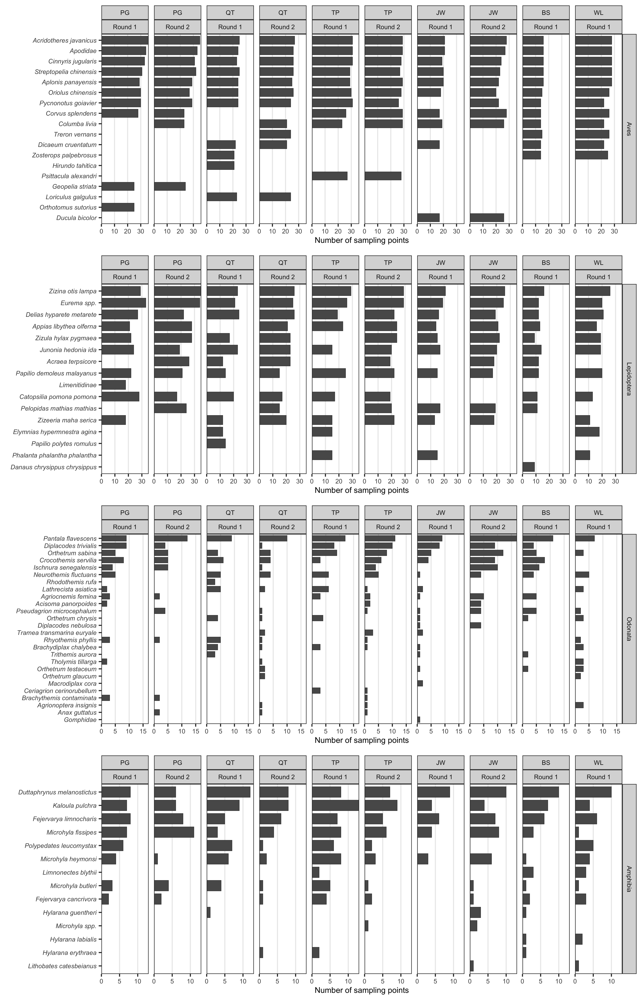
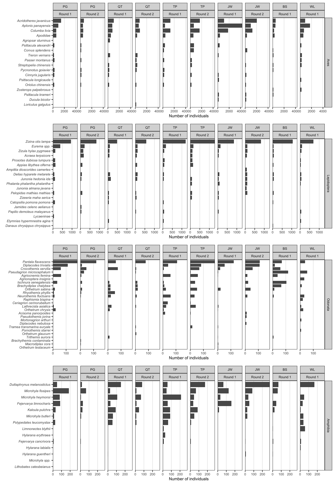
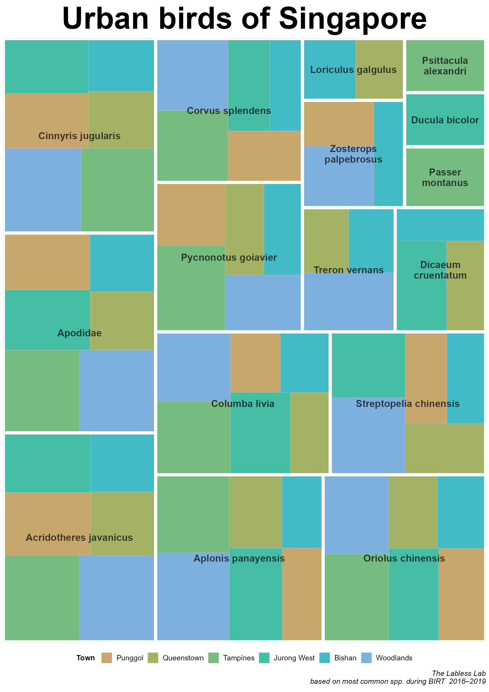

```{r, include = FALSE}
knitr::opts_chunk$set(
  collapse = TRUE,
  comment = "#>"
)
```

## Obtain latest taxonomic names and local statuses

Obtain latest accepted taxonomic names and local statuses for all four surveyed fauna groups (Birds, Butterflies, Odonates, Amphibians). Our sources for accepted taxonomic names and local statuses are listed below.

- Birds: ebird Clements Checklist and The Singapore Red Data Book (Davison et al. 2008)
- Butterflies: A Field Guide to the Butterflies of Singapore (Khew, 2010)
- Odonates: The Dragonflies of Singapore: an updated checklist and revision of the national conservation statuses (Ngiam & Cheong, 2016)
- Amphibians: A Guide to the Amphibians & Reptiles of Singapore (Lim & Lim, 2002)

The taxonomic names and local statuses are then matched to fauna list.

## Most common animal species per town

Surveys are summarised according to the top 10 most common animal species per town, which means the species with the most number of observed instances in the sampling points. This is done by filtering the dataset according to each animal group, town, round and number of entries of each species.

```{r sptally - most common animal species, eval = FALSE}
# summarise sp density sampling pt per town
plot_fauna <- fauna %>%
  
  # add up same sp recorded at diff times in same survey, & diff cycles (result in counts of unique species per sampling pt in survey year)
  ungroup() %>%
  group_by(species, town, round, priority, point_id) %>%
  summarise() %>% 
  
  # exclude genus/family lvl records if all sp within grp observed
  anti_join(rmspp$point, by = c("species" = "name","point_id", "round")) %>%
   
  # no of points that each sp occur (per taxa per town)
  ungroup() %>%
  group_by(species, town, round, priority) %>% 
  summarise(count = n())  %>%
  mutate(round = fct_recode(round, "Round 1" = "1", "Round 2" = "2")) # for plotting

  
# Birds
order  <- plot_fauna %>% # summarise order of species
  filter(priority == "Aves") %>%
  ungroup() %>%
  group_by(species) %>%
  summarise(order = sum(count))

plot_bird <- 
  plot_fauna %>%
  filter(priority == "Aves") %>%

  # only plot top 10 species in each town 
  ungroup() %>%
  group_by(town, round) %>%
  slice_max(count, n = 10) %>%
  left_join(order) %>% # get order

  ggplot(aes(y = count, x = reorder(species, order))) +
    geom_col(width = 0.8, 
             color = "black", size =0.1) +
    facet_grid(priority ~ town + round) +
    
    ylab("Number of sampling points") +
    xlab("")+
    theme_bw()+
    theme(text = element_text(size=8.0),
          axis.text.y = element_text(face = "italic"),
          panel.grid.major.y = element_blank(),
          panel.grid.minor.y = element_blank(),
          panel.grid.minor.x = element_blank()) +
    coord_flip() +
    scale_y_continuous(expand = c(0,0), breaks = scales::breaks_pretty(n = 4))


# Butts
order  <- plot_fauna %>% # summarise order of species
  filter(priority == "Lepidoptera") %>%
  ungroup() %>%
  group_by(species) %>%
  summarise(order = sum(count))

plot_butt <- plot_fauna %>%
  filter(priority == "Lepidoptera") %>%

  # only plot top 10 species in each town 
  ungroup() %>%
  group_by(town, round) %>%
  slice_max(count, n = 10) %>%
  left_join(order) %>% # get order

  ggplot(aes(y = count, x = reorder(species, count))) +
    geom_col(width = 0.8, 
             color = "black", size =0.1) +
    facet_grid(priority ~ town + round) +
    
    ylab("Number of sampling points") +
    xlab("")+
    theme_bw()+
    theme(text = element_text(size=8.0),
          axis.text.y = element_text(face = "italic"),
          panel.grid.major.y = element_blank(),
          panel.grid.minor.y = element_blank(),
          panel.grid.minor.x = element_blank()) +
    coord_flip() +
    scale_y_continuous(expand = c(0,0), breaks = scales::breaks_pretty(n = 4))
  

# Dragonfiles
order  <- plot_fauna %>% # summarise order of species
  filter(priority == "Odonata") %>%
  ungroup() %>%
  group_by(species) %>%
  summarise(order = sum(count))

plot_dragon <- plot_fauna %>%
  filter(priority == "Odonata") %>%

  # only plot top 10 species in each town 
  ungroup() %>%
  group_by(town, round) %>%
  slice_max(count, n = 10) %>%
  left_join(order) %>% # get order

  ggplot(aes(y = count, x = reorder(species, count))) +
    geom_col(width = 0.8, 
             color = "black", size =0.1) +
    facet_grid(priority ~ town + round) +
    
    ylab("Number of sampling points") +
    xlab("")+
    theme_bw()+
    theme(text = element_text(size=8.0),
          axis.text.y = element_text(face = "italic"),
          panel.grid.major.y = element_blank(),
          panel.grid.minor.y = element_blank(),
          panel.grid.minor.x = element_blank()) +
    coord_flip() +
    scale_y_continuous(expand = c(0,0), breaks = scales::breaks_pretty(n = 4))


# Frogs
order  <- plot_fauna %>% # summarise order of species
  filter(priority == "Amphibia") %>%
  ungroup() %>%
  group_by(species) %>%
  summarise(order = sum(count))

plot_frog <- plot_fauna %>%
  filter(priority == "Amphibia") %>%

  # only plot top 10 species in each town 
  ungroup() %>%
  group_by(town, round) %>%
  slice_max(order_by = count, n = 10) %>%
  left_join(order) %>% # get order

  ggplot(aes(y = count, x = reorder(species, count))) +
    geom_col(width = 0.8, 
             color = "black", size =0.1) +
    facet_grid(priority ~ town + round) +
    
    ylab("Number of sampling points") +
    xlab("")+
    theme_bw()+
    theme(text = element_text(size=8.0),
          axis.text.y = element_text(face = "italic"),
          panel.grid.major.y = element_blank(),
          panel.grid.minor.y = element_blank(),
          panel.grid.minor.x = element_blank()) +
    coord_flip() +
    scale_y_continuous(expand = c(0,0), breaks = scales::breaks_pretty(n = 4))
  

# combined plot
ggpubr::ggarrange(plot_bird, plot_butt, plot_dragon, plot_frog, 
          #labels = c("a)", "b)", "c)", "d)"),
          ncol = 1,
          nrow = 4,
          align = "v",
          font.label = list(size = 12, color = "black", 
                            face = "bold", family = NULL)
          ) 
```

{#id .class width=80% height=80%}

## Most abundant animal species per town

Surveys are summarised according to the top 10 most abundant animal species per town, which means the most number of individuals of a species observed in the sampling points. This is done by filtering the dataset according to each animal group, town, round and total number of individuals observed of each species

```{r sptally - most abundant species, eval = FALSE}
# summarise sp density per town
plot_fauna <- fauna %>%
  ungroup() %>%
  group_by(town, round, priority, species) %>% 
  summarise(count = sum(abundance)) %>%
  mutate(round = fct_recode(round, "Round 1" = "1", "Round 2" = "2")) # for plotting
  

# Birds
order  <- plot_fauna %>% # summarise order of species
  filter(priority == "Aves") %>%
  ungroup() %>%
  group_by(species) %>%
  summarise(order = sum(count))

plot_bird <- plot_fauna %>%
  filter(priority == "Aves") %>%

  # only plot top 10 species in each town 
  ungroup() %>%
  group_by(town, round) %>%
  slice_max(count, n = 10) %>%
  left_join(order) %>% # get order

  ggplot(aes(y = count, x = reorder(species, count))) +
    geom_col(width = 0.8, 
             color = "black", size =0.1) +
    facet_grid(priority ~ town + round) +
    
    ylab("Number of individuals") +
    xlab("")+
    theme_bw()+
    theme(text = element_text(size=8.0),
          axis.text.y = element_text(face = "italic"),
          panel.grid.major.y = element_blank(),
          panel.grid.minor.y = element_blank(),
          panel.grid.minor.x = element_blank()) +
    coord_flip() +
    scale_y_continuous(expand = c(0,0), breaks = scales::breaks_pretty(n = 3))


# Butts
order  <- plot_fauna %>% # summarise order of species
  filter(priority == "Lepidoptera") %>%
  ungroup() %>%
  group_by(species) %>%
  summarise(order = sum(count))

plot_butt <- plot_fauna %>%
  filter(priority == "Lepidoptera") %>%

  # only plot top 10 species in each town 
  ungroup() %>%
  group_by(town, round) %>%
  slice_max(count, n = 10) %>%
  left_join(order) %>% # get order

  ggplot(aes(y = count, x = reorder(species, count))) +
    geom_col(width = 0.8, 
             color = "black", size =0.1) +
    facet_grid(priority ~ town + round) +
    
    ylab("Number of individuals") +
    xlab("")+
    theme_bw()+
    theme(text = element_text(size=8.0),
          axis.text.y = element_text(face = "italic"),
          panel.grid.major.y = element_blank(),
          panel.grid.minor.y = element_blank(),
          panel.grid.minor.x = element_blank()) +
    coord_flip() +
    scale_y_continuous(expand = c(0,0), breaks = scales::breaks_pretty(n = 3))
  

# Dragonflies
order  <- plot_fauna %>% # summarise order of species
  filter(priority == "Odonata") %>%
  ungroup() %>%
  group_by(species) %>%
  summarise(order = sum(count))

plot_dragon <- plot_fauna %>%
  filter(priority == "Odonata") %>%

  # only plot top 10 species in each town 
  ungroup() %>%
  group_by(town, round) %>%
  slice_max(count, n = 10) %>%
  left_join(order) %>% # get order

  ggplot(aes(y = count, x = reorder(species, count))) +
    geom_col(width = 0.8, 
             color = "black", size =0.1) +
    facet_grid(priority ~ town + round) +
    
    ylab("Number of individuals") +
    xlab("")+
    theme_bw()+
    theme(text = element_text(size=8.0),
          axis.text.y = element_text(face = "italic"),
          panel.grid.major.y = element_blank(),
          panel.grid.minor.y = element_blank(),
          panel.grid.minor.x = element_blank()) +
    coord_flip() +
    scale_y_continuous(expand = c(0,0), breaks = scales::breaks_pretty(n = 2))


# Frogs
order  <- plot_fauna %>% # summarise order of species
  filter(priority == "Amphibia") %>%
  ungroup() %>%
  group_by(species) %>%
  summarise(order = sum(count))

plot_frog <- plot_fauna %>%
  filter(priority == "Amphibia") %>%

  # only plot top 10 species in each town 
  ungroup() %>%
  group_by(town, round) %>%
  slice_max(order_by = count, n = 10) %>%
  left_join(order) %>% # get order

  ggplot(aes(y = count, x = reorder(species, count))) +
    geom_col(width = 0.8, 
             color = "black", size =0.1) +
    facet_grid(priority ~ town + round) +
    
    ylab("Number of individuals") +
    xlab("")+
    theme_bw()+
    theme(text = element_text(size=8.0),
          axis.text.y = element_text(face = "italic"),
          panel.grid.major.y = element_blank(),
          panel.grid.minor.y = element_blank(),
          panel.grid.minor.x = element_blank()) +
    coord_flip() +
    scale_y_continuous(expand = c(0,0), breaks = scales::breaks_pretty(n = 3))
  

# combined plot
ggpubr::ggarrange(plot_bird, plot_butt, plot_dragon, plot_frog, 
          #labels = c("a)", "b)", "c)", "d)"),
          ncol = 1,
          nrow = 4,
          align = "v",
          font.label = list(size = 12, color = "black", 
                            face = "bold", family = NULL)
          ) 
```

{#id .class width=80% height=80%}

## Visualisation of the most common species in each town

Using a treemap, we are able to visualise the most common species relative to each town and each species.

```{r sptally - visualise most common species, eval = FALSE}

library(tidyverse)
library(treemapify)

surveys_normalised <- read_csv("data-raw/surveys_normalised.csv") %>%
  mutate(town = factor(town, levels = c("PG", "QT", "TP","JW", "BS", "WL"))) %>%
  mutate(town = fct_recode(town, "Punggol" = "PG", "Queenstown" = "QT", "Tampines" = "TP", "Jurong West" = "JW", "Bishan" = "BS", "Woodlands" = "WL")) %>%
  mutate(priority = factor(priority, levels = c("Aves", "Lepidoptera", "Odonata", "Amphibia"))) %>%
  mutate(survey_id = as.factor(survey_id)) %>%
  mutate(point_id = as.factor(point_id)) %>% 
  filter(round == 1) # only for round 1!

fauna_normalised <- read_csv("data-raw/fauna_normalised.csv") %>%
  mutate(town = factor(town, levels = c("PG", "QT", "TP","JW", "BS", "WL"))) %>%
  mutate(town = fct_recode(town, "Punggol" = "PG", "Queenstown" = "QT", "Tampines" = "TP", "Jurong West" = "JW", "Bishan" = "BS", "Woodlands" = "WL")) %>%
  mutate(priority = factor(priority, levels = c("Aves", "Lepidoptera", "Odonata", "Amphibia"))) %>%
  mutate(survey_id = factor(survey_id, 
                            levels = surveys_normalised$survey_id)) %>%
  mutate(point_id = factor(point_id, 
                           levels = unique(surveys_normalised$point_id))) %>% 
  filter(round == 1) # only for round 1!

# grp-lvl observations to remove
source("R/check_taxongrps.R")
rmspp_town <- check_taxongrps(fauna_normalised, level = "town")
rmspp_point <- check_taxongrps(fauna_normalised, level = "point")
rmspp_normalised <- list(town = rmspp_town, point = rmspp_point)
rm(rmspp_town, rmspp_point)
rm(check_taxongrps)


# summarise sp density sampling pt per town
plot_fauna <- fauna_normalised %>%
  ungroup() %>%
  group_by(species, town, # round, 
           priority, point_id) %>%
  summarise() %>% 
  
  # exclude genus/family lvl records if all sp within grp observed
  anti_join(rmspp_normalised$point, by = c("species" = "name","point_id" 
                                           #, # "round"
                                           )) %>%
  
  # no of points that each sp occur (per taxa per town)
  ungroup() %>%
  group_by(species, town, # round, 
           priority) %>% 
  summarise(count = n())

  
# Birds - top 10 common spp in each town 
plot_fauna %>%
  filter(priority == "Aves") %>%
  ungroup() %>%
  group_by(town #, round
           ) %>%
  slice_max(count, n = 10) %>% 
  
  ggplot(aes(area = count, fill = town, # label = species,
             subgroup = species)) +
    geom_treemap() +
    # geom_treemap_text(colour = "white",
    #                   place = "centre",
    #                   size = 5, grow = TRUE,
    #                   fontface = "italic") +
  
    geom_treemap_subgroup_border(color = "white", size = 7) +
    geom_treemap_subgroup_text(place = "centre", 
                               size = 16,
                               # min.size = 12, 
                               grow = FALSE,
                               reflow = TRUE, # wrap text
                               alpha = 0.7, colour = "black",
                               fontface = "bold") +

  colorspace::scale_fill_discrete_qualitative("Harmonic") +
  # colorspace::scale_fill_discrete_qualitative("Dynamic") +
  # scale_fill_viridis_d(alpha = 0.6) +
  # scale_fill_brewer(palette = "Paired") +
  # scale_fill_brewer(palette = "Set3") +
  
  labs(title="Urban birds of Singapore",
       caption="The Labless Lab\nbased on most common spp. during BIRT  2016–2019",
       fill = "Town ") +
  theme(aspect.ratio = aspectratio_plot,
        plot.background = element_blank(),
        panel.background = element_rect(fill = "transparent"),
        panel.border = element_blank(),
        rect = element_rect(fill = "transparent"),
        plot.title.position = 'plot', 
        plot.title = element_text(hjust = 0.5, size = 50, face = "bold"),
        plot.caption = element_text(size = 12, face = "italic"),
        legend.position="bottom",
        legend.title = element_text(face = "bold", size = 12),
        legend.text = element_text(size = 12)) +
    guides(fill = guide_legend(nrow = 1))
ggsave(glue::glue("{dir_export}/urban-birds-sg_lightback.png"), 
       height = height_export, width = height_export/sqrt(2), 
       units = "cm",
       dpi=150, type="cairo-png", bg = "transparent")
```

{#id .class width=25% height=100%}
