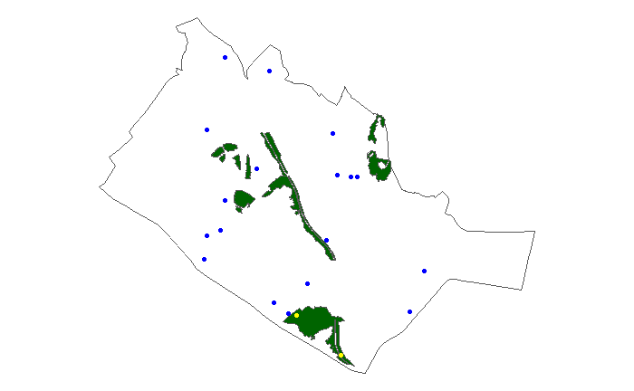
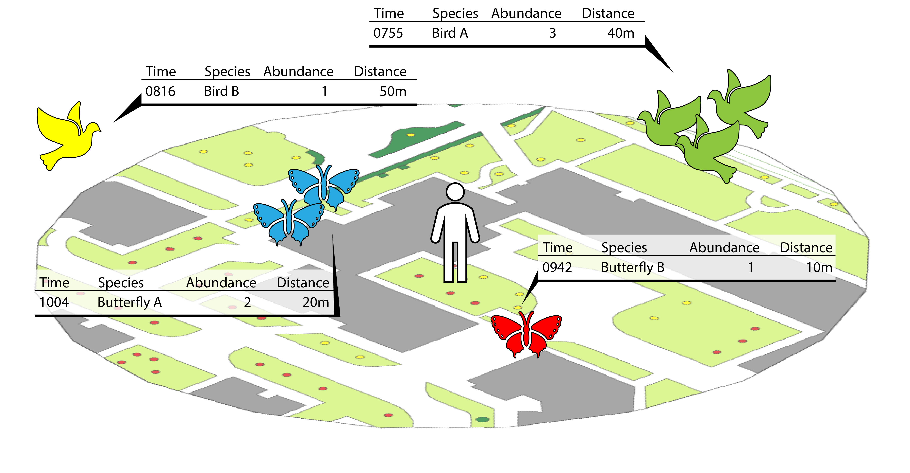
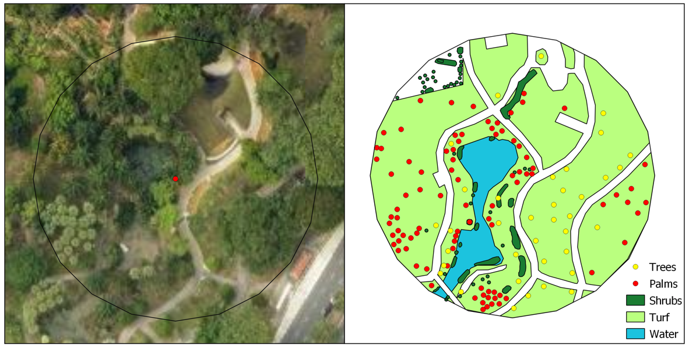

This article describes how surveys are carried out for the BIRT project, and how the data is recorded.

## Pre-survey preparations

### Sampling point generation

Before surveys can begin, survey points are randomly generated to best represent the area of interest and its variables. If new data in previous or new areas of interest is to be collected, more points can be randomly generated with respect to the two land cover types: `Urban` and `Forest`. 

The following example covers how the residential town of Queenstown is randomly sampled at a point density of one point per 50 hectares, with a survey radius of 50 m for each point. An excess modifier of `1.5` is set to generate `1.5` times more points than is required for the specified point density, in case points were determined to be inaccessible later in the Survey Period.

First, load and process the example dataset to retrieve the Queenstown data only. 

```{r process example data, eval = FALSE}
data("sampling_areas")

queenstown <- sampling_areas[sampling_areas$area %in% "QT", ]
queenstown_forest <- queenstown[queenstown$landcover == "Forest",]

```

Run `random_pt_gen()` with the above parameters and plot to visualise the generated points. 

```{r random point generation, eval = FALSE}
points <- random_pt_gen(x = queenstown, #function uses st_read, gives error here since sample is alr an sf obj
                        area_per_pt = 500000,
                        pt_buffer = 50,
                        forest = queenstown_forest,
                        excess_modifier = 1.5)

ggplot(data = queenstown) +
  geom_sf(fill = NA) +
  theme_void() +
  geom_sf(data = queenstown_forest, fill = "darkgreen") +
  geom_sf(data = points, col = ifelse(points$class == "Urban", "blue", "yellow"), show.legend = "point")
```



<br>


If there is a need to retain survey points from a previous period, the example below shows how new points can be generated without overlap. Here, within the same area of Queenstown, load example points to simulate points in Survey Period 1 for re-surveying in Survey Period 2. If only half of the previous points are to be retained, `survey_prop` can be set to "0.5".  

```{r random point generation with retain, eval = FALSE}
data("sampling_points")

queenstown_retain <- sampling_points[sampling_points$area %in% "QT" & sampling_points$period %in% "1", ]

points <- random_pt_gen(x = queenstown,
                        area_per_pt = 500000,
                        pt_buffer = 50,
                        forest = queenstown_forest,
                        retain = queenstown_retain,
                        retain_prop = 0.5,
                        excess_modifier = 1.5)
```

After obtaining the generated points, surveyors are to then assess the points and the surrounding areas up to the above buffer radius for potential on-site disturbances to wild animals. Approved points are then selected according to the order in which they were generated (i.e. the point `id`) to maintain randomness.

---

### Animal data collection format

To conduct new surveys or to build models on existing data, the format in which the data is organised is shown below. Animal data is separated into the survey data and survey info datasets, where the former includes the individual observation records and the latter contains meta information on each 30 minutes survey.

```{r sample data table, echo = FALSE, message = FALSE, warning = FALSE}

# show sample data in kable
library("dplyr")

# use either library (having installed package with latest changes) or load_all (package in development)
# library("biodivercity")
devtools::load_all() #knit manually with latest changes to circumvent library("biodivercity") (use in final version)

data(animal_observations)

knitr::kable(head(animal_observations), caption = "**Sample survey data format**") %>%
  kableExtra::kable_styling("striped", font_size = 10) %>% kableExtra::scroll_box(width = "100%")
```

```{r sample info table, echo = FALSE, message = FALSE}
# show sample info in kable
data(animal_surveys)

knitr::kable(head(animal_surveys), caption = "**Sample survey info format**") %>%
  kableExtra::kable_styling("striped", font_size = 10)
```

---

## Animal survey methods

General animal survey protocol for the BIRT project consisted of **30 minute** surveys in the designated buffer radius around the generated points once every two months for a year (6 cycles per Survey Round). Surveyors can move within the area to identify and count any species belonging to the priority taxon of each survey. 



Survey time windows and buffer radii varied for each priority taxon and were chosen based on previous research. The four priority animal taxa surveyed and included in the example data are shown in the table below with their specific survey details. 

```{r survey type table, echo = FALSE}

Taxon <- c("Birds", "Butterflies", "Odonates", "Amphibians")
Time <- c("0700–0930", "0930–1200", "1400–1600", "2000–2200")
Radius <- c("50m", "20m", "20m", "20m")

survey_types <- data.frame(Taxon, Time, Radius)

knitr::kable(survey_types, caption = "**Animal survey types**") %>%
  kableExtra::kable_styling("striped", font_size = 10) %>%
  kableExtra::kable_styling(position = "center")
```

For ephemeral water points, odonate and amphibian surveys were conducted within 24 hours after a rain event at the sampling point. The rain event had to be of at least a light–moderate intensity with reference to the [Meteorological Service Singapore's live map of Rain Areas](http://www.weather.gov.sg/weather-rain-area-50km/).

---

## Plant survey methods

Plant surveys were split into two types according to the `Urban` or `Forest` land-cover where the plants are located. 

`Urban` plant surveys were conducted within the same 50m radius of the animal survey points. Cultivated trees, palms, shrubs and turf were mapped manually on-site and identified to the species-level. For digitising in geographic information system (GIS) software, trees and palms were drawn as `Point` layers while shrubs and turfs were drawn as `Polygon` layers.



`Forest` plant surveys were dependent on existing forest patches in the sampling areas. Available maps and satellite images were first checked for natural vegetation cover that were unmanaged within the sampling area boundaries. After locating such patches, surveys were then carried out to identify all unique vascular plant species present. Surveyors would also trace the existing outlines of these forest patches by walking the perimeter with a Global Positioning System (GPS) device. Plant specimens were collected if they were not identifiable on-site and photographs were taken of plants that were out-of-reach. 

Locations of any ‘rare’ plant species identified were recorded with the GPS. These include species that were not locally cultivated, and ‘critically endangered’ or ‘extinct’ according to the Singapore Red Data Book, 2nd Edition (Davison et al., 2008).

