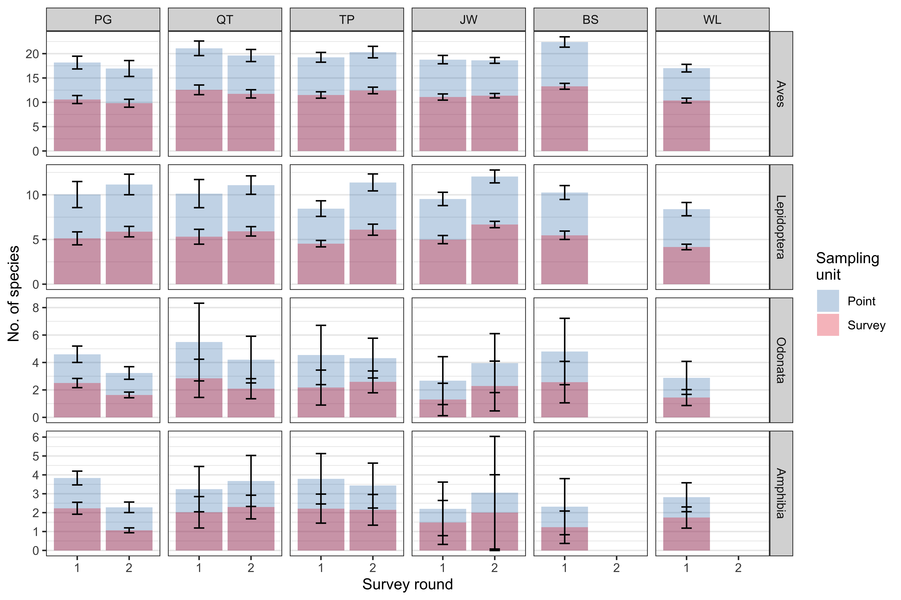

```{r, include = FALSE}
knitr::opts_chunk$set(
  collapse = TRUE,
  comment = "#>"
)
```

## Overview

The project objectives are to:

This package facilitates existing analyses

## 1. Pre-survey preparations

### Sampling point generation
To generate random sampling points for the collection of new data, the research area is first randomly sampled at a specified point density. Land cover is stratified into two main classes of *natural vegetation* and *urban* land cover. These two land cover types are randomly sampled independently at a point density of one point per 50 hectares of land. 

```{r random point generation, eval = FALSE}
data(area)

points <- random_pt_gen()
```


### Data collection format

```{r sample data table, echo = FALSE, message = FALSE, warning = FALSE}

# show sample data in kable
library("dplyr")

# use either library (having installed package with latest changes) or load_all (package in development)
# library("biodivercity")
devtools::load_all() #knit manually with latest changes to circumvent library("biodivercity") (use in final version)

data(fauna)

knitr::kable(head(fauna), caption = "**Sample survey data format**") %>%
  kableExtra::kable_styling("striped", font_size = 10) %>% kableExtra::scroll_box(width = "100%")
```

```{r sample info table, echo = FALSE, message = FALSE}
# show sample info in kable
data(surveys)

knitr::kable(head(surveys), caption = "**Sample survey info format**") %>%
  kableExtra::kable_styling("striped", font_size = 10) %>% kableExtra::scroll_box(width = "100%")
```

## 2. Process survey data

Collected fauna survey data in the format detailed in the previous section can be easily subset with respect to `town`, `round` and/or `priority` with the `filter_obs` function. For example, a specific set of surveys (i.e. butterfly surveys in Tampines from 2020-2021) can be filtered as follows:

```{r filter_obs example, eval = FALSE}
data(fauna)
data(surveys)

butterflies_tampines_round_2 <- filter_obs(observations = fauna, survey_ref = surveys,
                   specify_taxon = "Lepidoptera",
                   specify_area = "TP",
                   specify_period = "2")
```

Checks are then performed to remove uncertain fauna identifications to prevent over-counting. 

```{r check taxon groups, eval = FALSE}

```

Next, the surveys are then filtered to remove all surveys at sampling points that are surveyed less than three times. The remaining surveys are normalised by randomly removing sampling points from sampling zones to achieve similar point densities across all areas. Three surveys are then randomly selected per sampling point and taxon, and the removal process is repeated 30 times to obtain bootstrapped results. This normalised dataset is used to summarise species richness and species accumulation curves across sampling areas:

```{r sptally, eval = FALSE}
# BY POINT
normalised_perpt <- 
  foreach(i = seq_along(fauna_normalised), 
          .packages = "tidyverse") %dopar% {
 
  #get unique data to input to loop later
  unique <- surveys_normalised[[i]] %>%
    distinct(town, round, priority)
  
  results <- data.frame()
  
  for(j in 1:nrow(unique)){
  
    sptally_data <- 
      sptally_extractor(observations = fauna_normalised[[i]],
                        survey_ref = surveys_normalised[[i]],
                        specify_town = unique$town[j], 
                        specify_round = unique$round[j], 
                        specify_priority = unique$priority[j],
                        level = "point")
    
    # bind to plot_sac & overwrite
    results <- results %>%
      bind_rows(sptally_data)
    
    rm(sptally_data)
  }
            
  results                     
}

# summarise & stats
normalised_perpt <- normalised_perpt %>% 
  map_dfr(~ bind_rows(.), .id = "iteration") %>% # unlist 
  mutate(iteration = as.numeric(iteration)) %>% 
    
  # add iteration-level summaries
  group_by(iteration, 
           town, round, priority) %>% 
  summarise(mean = mean(n, na.rm = T) #,
            #se = sd(n, na.rm = T)/sqrt(length(n))
            ) %>% 
  mutate(type = "Point") %>%
  
  # for plotting
  mutate(town = factor(town, levels = c("PG", "QT", "TP","JW", "BS", "WL"))) %>%
  mutate(priority = factor(priority, levels = c("Aves", "Lepidoptera", "Odonata","Amphibia"))) %>%
  mutate(round = as.factor(round))
```

{#id .class width=80% height=80%}

```{r sac, eval = FALSE}

# loop across all bootstrapped iterations

plot_sac <- 
  foreach(i = seq_along(fauna), 
          .packages = "tidyverse") %dopar% {
  
  unique <- surveys[[i]] %>%
    distinct(town, round, priority)
            
  results <- data.frame()
  
  for(j in 1:nrow(unique)){
    
    sac_data <- sac_extractor(observations = fauna[[i]], 
                              survey_ref = surveys[[i]],
                              specify_town = unique$town[j], 
                              specify_round = unique$round[j], 
                              specify_priority = unique$priority[j])
    
    # bind to plot_sac & overwrite
    results <- results %>%
      bind_rows(sac_data)
    
    rm(sac_data)
  }
  
  results
}

# unlist & calc mean across iterations
plot_sac <- plot_sac %>% 
  map_dfr(~ bind_rows(.), .id = "iteration") %>% 
  mutate(iteration = as.numeric(iteration)) %>% 
  group_by(town, round, priority, sites) %>% 
  summarise(mean = mean(richness),
            sd = sd(richness, na.rm = TRUE))

```

{#id .class width=80% height=80%}


### 3. Process landscape data

Landscape information is retrieved from the publicly available Sentinel-2 database using the `sen2r` package. As this is an external package unrelated to `biodivercity`, please also refer to the official repository for updated instructions. 

To model for fauna species richness across the six towns from 2016 to 2019, the spatio-temporal selections can be set accordingly to download all available Sentinel-2 images with the `sen2r()` GUI interface. 

```{r sen2r setup, eval = FALSE}
# http://sen2r.ranghetti.info/articles/installation.html
install.packages("sen2r")

# install Sen2Cor software (atmospheric correction for Level-1C products)
library(sen2r)
check_sen2r_deps() # check dependencies
install_sen2cor(force = TRUE) # install via command instead of GUI

out_dir  <- glue::glue("{dir_dataoutput}/spatial/satellite-images/sen2r/sen2r_", {as.character(params$sen2r_date_range[1])}, "-to-", {as.character(params$sen2r_date_range[2])})

# run this after every successful download if there are still files in LTA not yet online, then subsequently check with provided safe_is_online() and sen2r():
out_paths <- sen2r(
  param_list = params$sen2r_params,
  timewindow = c(as.Date(params$sen2r_date_range[1]), as.Date(params$sen2r_date_range[2])),
  path_l2a = params$sen2r_dir_rawdata, # level-2A SAFE products
  path_l1c = params$sen2r_dir_rawdata, # level-1C SAFE products
  path_out = out_dir,
  path_indices = out_dir,
  extent_as_mask = TRUE,
  list_rgb = "RGB432B" # output RGB image
  # max_mask = 15,
  # list_indices = c("NDVI", "ARI")
  )
```

After downloading the raster files within their specific index directories, we have to mosaic the individual images to account for data deficiencies from cloud cover. 

```{r mosaic generation, eval = FALSE}
 mosaic_sen2r(parent_dir = out_dir,
              exclude = NULL,
              rm_outlier = TRUE)
```

We then classify the resulting mosaics according to their respective indices. We use Otsu's thresholding (see article) to define threshold values where any value above the threshold is regarded as a presence of the landscape type measured by an index.

```{r mosaic classification, eval = FALSE}
classify_mosaic(x = "out_dir/index/mosaic.tif",
                otsu = TRUE,
                output = "out_dir/classified/")
```

With the classified mosaics, we can isolate landscape metrics at a defined buffer distance around fauna sampling points. The sample datasets `data(points)`, `data(NDVI)` and `data(NDWI2)` contains the survey points and the classified mosaics for NDVI and NDWI2. 

```{r lsm_perpoint, eval = FALSE}
data(points)
veg_classified <- data(NDVI)
water_classified <- data(NDWI2)

circles <- lsm_perpoint(raster = veg_classified, points = points, 
                        buffer_sizes = c(50, 100, 126, 200, 400, 600, 800, 1000),
                        class_names = c("veg"),
                        class_values = c(1),
                        landscape_name = "veg",
                        level = c("class")) 

circles2 <- lsm_perpoint(raster = water_classified, points = points, 
                        buffer_sizes = c(50, 100, 126, 200, 400, 600, 800, 1000),
                        class_names = c("water"),
                        class_values = c(1),
                        landscape_name = "water",
                        level = c("class")) 

for(i in 1:length(circles)){ # append to circles2 info to circles
  circles[[i]] <- circles[[i]] %>%
    full_join(circles2[[i]] %>% 
                 mutate(across(.cols = starts_with("lsm_"), 
                  ~ifelse(percentage_inside < 90, NA, .))) %>%
                dplyr::select(-percentage_inside), 
              by = c("point_id", "round"))
}
```

Next, urban landscape elements are retrieved from the freely-available OpenStreetMap (OSM) database. In the Sentinel-2 images, buildings would be represented by their building footprint as opposed to three-dimensional structures. We can download the number of above-ground levels as a proxy for building height, especially in residential buildings where the floor-to-floor height is standardised (Building height data may also be supplied by government databases if available (e.g. [HDB Property Information from data.gov.sg](https://data.gov.sg/dataset/hdb-property-information)).). Building polygons and road lines are extracted from a set geographical boundary with the functions `get_buildings_osm` and `get_roads_osm`. `home2park`, a GitHub package, and `osmextract` are required dependencies for these functions and this package. 

```{r download urban elements w parallel loops, eval = FALSE}
osm_boundaries <- data(boundaries) %>% 
  # st_union() %>% # merge all subzones
  st_as_sf() %>%
  st_make_valid()

# get_roads_osm is not in home2park package. Need to load dependency libraries

foreach(i = seq_along(params$osm_download_dates), 
                   .packages = c("home2park",
                                 "tidyverse", "sf", "osmextract")) %dopar% { 
  
  # buildings                   
  get_buildings_osm(osm_boundaries, 
                    date = params$osm_download_dates[i],
                    dir_raw = params$osm_dir_rawdata,
                    filename = paste0(dir_dataoutput, "/landscape/osm/buildings_osm-polygons_", params$osm_download_dates[i], ".geojson"))
              
  # roads
  get_roads_osm(osm_boundaries, 
                date = params$osm_download_dates[i],
                dir_raw = params$osm_dir_rawdata,
                filename = paste0(dir_dataoutput, "/landscape/osm/roads_osm-lines_", params$osm_download_dates[i], ".geojson"))       
                     
  rm(i)                   
}
```

### 4. Building of models

To be added.

### 5. Spatial predictions

`geom_to_grid` overlays a grid over a target area where species richness predictions are desired. This function is a wrapper for the `st_make_grid` function with `what == "centers"`, from the package `sf`. The output is an object of class `sfc` that comprise of points at which landscape metrics are extracted from their respective distance buffers. Grid dimensions are variable and can be specified with `grid_dim`. `buffer_dist` is an optional argument for situations where landscape data is limited to the target area or smaller. The distance value for this argument should correspond to the largest buffer present in the variables, so as to not include areas with no landscape data.

```{r create grid for each UGS town, eval = FALSE}
# subset to regions where predictions can be made: >126m inwards from boundaries
bound_grid <- geom_to_grid(geom = bound,
                           buffer_dist = 126,
                           grid_dim = c(50, 50))
```
{#id .class width=60% height=60%}

The `heatmap_raster` function is a combination of multiple functions that result in a final raster of species richness predictions for one taxon. A breakdown of the function is as follows:

1. Species richness is predicted at each point provided in the `geom` argument with the objects specified in `mods`, `env_df` and `landscape`.
2. A second grid is created using `st_make_grid` with `what == "polygons"` as a template for the final raster.
3. The grid template and prediction values are combined with `rasterize` from the `terra` package.

**Note**: Variables used in `landscape` should match variables in `env_df`.

```{r heatmap_raster, eval = FALSE}
# Minor edits to the env_df had to be made
# bird_env <- birds %>% 
#   dplyr::select(where(is.numeric) & !sprich) %>% 
#   dplyr::select(!r50m_man_GnPR) # non-GnPR dataset

bird_hm <- heatmap_raster(env_df = bird_env,
                          mods = birdmods,
                          landscape = grid_landscape,
                          geom = bound,
                          buffer_dist = 126,
                          grid_dim = c(50, 50),
                          name = "bird_hm") # optional
```

### Cross-validation

To be added.
